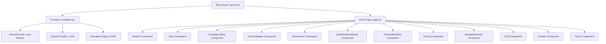

# Application Architecture - Rent4uSolutions

Rent4uSolutions utilizes a modular architectural model built on Next.js 15, optimized for visual performance, smooth animations, and zero hydration mismatches.

---

## 🏗 High-Level Architecture

The project is structured around a single, highly polished landing page with rich, interactive sub-sections:



---

## 🔄 Lifecycle & State Management

### 1. Global Scrolling & Theme State
- **Smooth Scroll Lifecycle**: Managed in [providers.tsx](file:///d:/SpaceX/۔کام/Learn%20with%20Hammad/Mustafa%20Rent/Rent4You%20New/components/providers.tsx). When the component mounts:
  - A new `Lenis` instance is created.
  - The Lenis scroll update function is bound to `GSAP ScrollTrigger.update`.
  - GSAP's ticker runs `lenis.raf(time * 1000)` on every frame, achieving hardware-accelerated smooth scrolling.
  - On cleanup, the instance is destroyed and the ticker hook is removed.
- **Theme Sync**: Provided by `NextThemesProvider` (packaged in `next-themes`). Themes are resolved on the `html` element using the CSS class `dark` or default fallback. A mounted check is used in the navbar button to prevent visual hydration discrepancies between server-rendered HTML and client-rendered settings.

### 2. Local State Control
- **Navbar Toggle (`navbar.tsx`)**: Controls scrolled state (`window.scrollY > 50`) and mobile drawer visibility (`mobileMenuOpen`).
- **Interactive Deal Preview (`deal-pack.tsx`)**: Uses GSAP timelines to stagger entrance of dashboard cards and draw connecting SVG dashed lines as the container enters the viewport.
- **FAQ Accordion (`faq.tsx`)**: Utilizes a single active index state (`openIndex: number | null`). The opening/closing transition is animated purely through CSS flexbox/grid layout interpolation:
  ```css
  /* Closed */
  grid-template-rows: 0fr;
  opacity: 0;
  
  /* Open */
  grid-template-rows: 1fr;
  opacity: 1;
  ```
  This is a highly performant CSS technique that avoids layout thrashing or manual height computations.
- **Forms (`sample-deal-pack.tsx` & `contact.tsx`)**: Managed using standard React controlled/uncontrolled state (e.g., `submitted: boolean` toggle for success feedback).

---

## 🧩 Component Detail Directory

| Component | Type | Responsibility | Interactive Hooks / APIs |
| :--- | :--- | :--- | :--- |
| `Navbar` | Client | Renders header logo, main anchors, theme switch, and drawer. | `useState`, `useEffect`, `useTheme` |
| `Hero` | Client | Displays full-viewport background slides with Ken Burns fade, text reveals. | `useRef`, `useEffect` (GSAP ScrollTrigger) |
| `ComplianceStrip` | Client | Lists regulatory compliance items. Staggers entries as scrolled into view. | `useRef`, `useEffect` (GSAP stagger) |
| `CoreStrategies` | Client | Cards representing Serviced Accommodation, Council, and Rent-to-Rent. | `useRef`, `useEffect` (GSAP, scroll triggers) |
| `WhyPartner` | Client | Visual checklist highlighting value propositions. | `useRef`, `useEffect` (GSAP scale/slide) |
| `DealPackDashboard`| Client | Renders the financials, property data, and risks of a sample deal pack. | `useRef`, `useEffect` (GSAP SVG lines, bar animation) |
| `ProcessWorkflow` | Client | Step-by-step progress timeline. Vertical progress indicator fills on scroll. | `useRef`, `useEffect` (GSAP ScrollTrigger scrub) |
| `Pricing` | Client | Side-by-side pricing tier grids. | `useRef`, `useEffect` (GSAP) |
| `SampleDealPack` | Client | Form to request a sample PDF deal pack. | `useState` (submission state) |
| `FAQ` | Client | Question & answer accordions. | `useState` (active index state) |
| `Contact` | Client | Main message form, location details, phone, and direct WhatsApp links. | `onSubmit` prevent-default handler |
| `Footer` | Client | Standard links, regulatory disclaimers, and copyright text. | Static layout |
