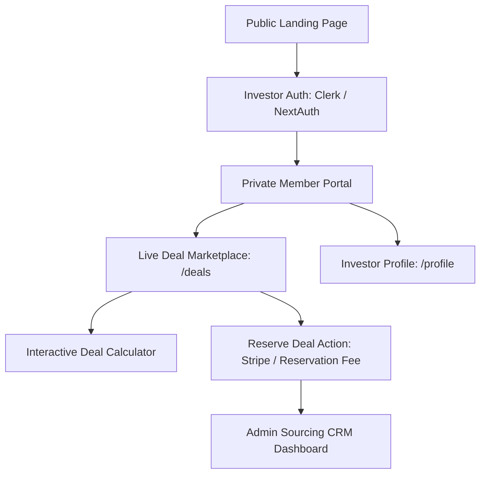

# Scalability, Refactoring & Feature Expansion - Rent4uSolutions

Rent4uSolutions has a highly polished landing page built on Next.js 15, but it operates as a static marketing page. To transition the application into a scalable sourcing platform, several backend, frontend, and architectural improvements are recommended.

---

## 🛠 Recommended Fixes & Optimizations

### 1. Resolve Dependency Constraints
- **Issue**: The current codebase uses React 19. React 19 has peer dependency conflicts with `next-themes (v0.3.0)`.
- **Fix**: Upgrade `next-themes` to `^0.4.4` or later, which formally supports React 19, or retain the `--legacy-peer-deps` flag in setup guides.
- **Action**: Update `package.json` to include newer, React 19-compatible ecosystem versions:
  ```json
  "next-themes": "^0.4.4"
  ```

### 2. Implement Real Form Submissions (Lead Capture API)
- **Issue**: Form components (`sample-deal-pack.tsx` and `contact.tsx`) use mock states and client-side `preventDefault()`.
- **Fix**: Create Next.js server actions or API Route Handlers under `/app/api/contact/route.ts` and `/app/api/deal-pack/route.ts`.
- **Integration**:
  - Connect forms to **Resend** or **Nodemailer** to dispatch automated emails.
  - Sync contacts with a CRM system like **HubSpot**, **ActiveCampaign**, or a backend database (e.g., **Supabase** / **Prisma**).

### 3. Dynamic Calculation Engine in Deal Dashboard
- **Issue**: The numbers in `deal-pack.tsx` are hardcoded.
- **Fix**: Convert the financial block into an interactive calculator. Allow investors to input parameters such as:
  - *Average Nightly Rate (ADR)*
  - *Target Occupancy Rate (%)*
  - *Management Fees (%)*
  - *Utility / Linen Expenses*
- Dynamic outputs:
  - *Gross Income*, *Net Cashflow*, and *Break-even Occupancy* calculate on-the-fly and update the GSAP progress indicators.

---

## 🚀 Scaling to a Production Sourcing Platform

If the project is ready to scale beyond a single page, the following architecture should be implemented:



### Phase 1: Authentication & Investor Whitelisting
- **Why**: Sourced Rent-to-Rent and Serviced Accommodation deals are highly confidential. Publishing detailed addresses publicly risks direct landlord bypass.
- **How**: Integrate **Clerk** or **NextAuth.js**. Require investors to sign up and undergo basic verification before gaining access to the detailed deal lists.

### Phase 2: Live Deal Marketplace (`/deals`)
- Create a dynamic route `/deals/[id]` showing comprehensive investor profiles for each property:
  - High-res photo carousel.
  - Interactive maps (neighborhood data, transport links).
  - Detailed, downloadable PDFs.
- Implement a search/filter system by region (e.g., Northwest, Midlands), strategy (SA, Council, R2R), and minimum net cashflow.

### Phase 3: Direct Deal Reservation (Stripe Integration)
- Connect a payment gateway (e.g., **Stripe**) to handle the £500 reservation fee.
- When an investor clicks "Reserve Opportunity," a temporary lock is placed on the database entry, and the reservation fee is charged. Upon success, the deal status shifts to "Reserved" and email notifications are sent to the sourcing team.

### Phase 4: Admin Sourcing CRM
- Build an admin route (`/admin`) for the sourcing team to upload and manage deals:
  - Easy upload forms for property images, address details, and financial parameters.
  - A dashboard to track user registrations, reservation payments, and completion schedules.
